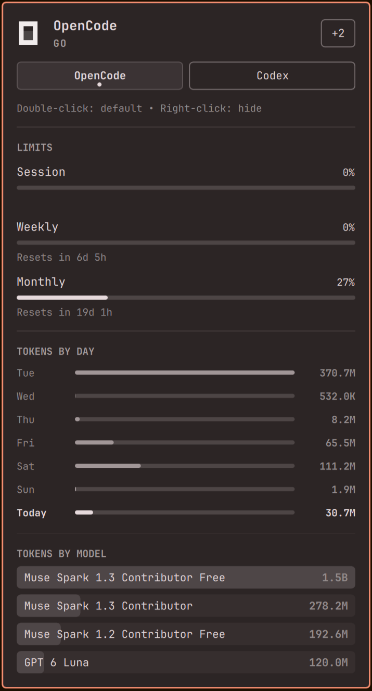

# Agents

Every AI coding subscription on the machine — one bar icon, one panel.



Needs: Omarchy · any AI coding CLI with usage to show · no sudo.

## What you get

- **One panel for all agents** — switch tabs per subscription, no separate widgets.
- **Limits with meters** — session, weekly, and monthly allowances plus reset times.
- **Tokens by day and model** — last 7 days plus per-model totals with input/output/cache split on hover.
- **Display only** — it draws usage records, never phones home. Credentials never reach the panel.
- **Extensible collectors** — a new provider is one Python file writing the same JSON contract.

## Install

```
omarchy plugin add https://github.com/tymurbogach/agents.git --enable
omarchy restart shell
```

The icon appears on its own the first time usage is found. With no agents recorded, the widget leaves the bar entirely.

## Use

| Action | Effect |
|---|---|
| Left click pill | Open / close the panel |
| Right click pill | Launch the agent |
| Middle click pill | Next subscription |
| Double-click chip | Make it the default agent |
| Right-click chip | Hide it (`+N` restores) |
| `h` / `l`, `j` / `k` | Switch tab, scroll |
| `r` or Enter | Refresh now |

Tabs appear only for enabled agents with recorded usage. Hiding also stops their scans.

## Providers

| Agent | Limits | Local stats |
|---|---|---|
| `claude` | OAuth endpoint (5h session + weekly) | `~/.claude/projects` transcripts |
| `codex` | App-server RPC (retried 3×) | Native CLI session files |
| `opencode` | Go rolling + weekly + monthly | `opencode.db` messages |
| `kimi` | Membership quota (5h + 7d) | `~/.kimi-code` wire logs |
| `fireworks` | Prepaid balance (estimated unless ledger opens) | Billing API, last 30 days |

Bundled collectors live in `collectors/` (`codex.py`, `kimi.py`, `opencode.py`). `claude` and `fireworks` run externally via `omarchy-agent-usage-update`. A record needs a non-empty `id` and follows `schemaVersion 1`; breakers are ignored with a warning.

## Settings

Inline on the bar entry (nested keys are JSON-only):

| Key | Default |
|---|---|
| `refreshIntervalSec` | `900` (30–3600) |
| `providers` | all enabled |
| `providerOrder` | `{}` (drag chips to reorder) |
| `syncMode` | `"Off"` (`"On"` merges snapshots from `syncDir`) |

```bash
omarchy bar set tymurbogach.agents refreshIntervalSec 300 --json
```

## Remove

Purge bundled caches first (external `claude`/`fireworks` state stays untouched):

```bash
python3 collectors/kimi.py --purge --yes
python3 collectors/opencode.py --purge --yes
omarchy plugin remove tymurbogach.agents
```

Shared usage records under `~/.local/state/omarchy/agents/usage/` stay. Delete them only if no other collector needs them.

## Changelog

See [CHANGELOG.md](CHANGELOG.md).

## License

MIT — see [LICENSE](LICENSE).
